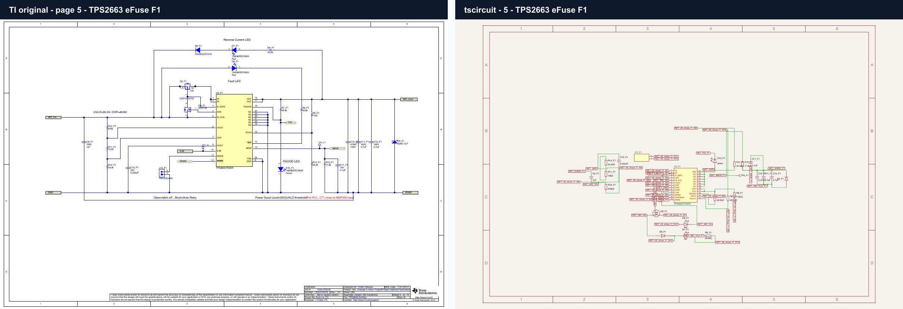

# TIDA-010076 schematic in tscircuit

[](https://github.com/tscircuit/schematic-parity-testing/actions/workflows/visual-snapshots.yml)

This project recreates the Texas Instruments TIDA-010076 schematic as a
15-sheet tscircuit design. It was transcribed from TI's official schematic PDF
and editable Altium design archive:

- Schematic: https://www.ti.com/lit/df/tidm615/tidm615.pdf
- Reference design: https://www.ti.com/tool/TIDA-010076
- Altium source archive: https://www.ti.com/lit/zip/tidm619

The generated design contains 365 placed components and 1,101 component pins.
It preserves TI reference designators, component values, manufacturer part
numbers, pin names, named power/signal nets, local connections, and the repeated
F1/F2 eFuse and P1/P2 PHY instances. Repeated-sheet local nets are namespaced to
prevent accidental cross-channel shorts.

Native tscircuit primitives are used for resistors, capacitors, inductors,
diodes, LEDs, test points, jumpers, net ties, connectors, MOSFETs, the crystal,
and fiducials. Generic chips remain only for complex ICs and parts whose actual
pin structure is not representable by a simpler primitive, including the
multi-winding magnetics, Kelvin shunt, and rotary BCD switches.

This is a schematic recreation. PCB generation and routing are disabled on the
root board, so the source should not be treated as a fabrication-ready clone of
TI's multilayer layout.

## Visual parity suite

Every page in TI's 17-page PDF has a checked-in paired PNG snapshot: the TI
reference is on the left and the corresponding tscircuit render is on the
right. PDF pages 2 through 16 map to the 15 recreated sheets. Page 1 is TI's
block diagram and page 17 is its legal notice, so those two comparisons use an
explicit no-corresponding-sheet panel.

The suite follows the visual matcher pattern used by `bun-match-svg` and the
PNG matcher in `tscircuit/poppygl`:

- `tests/fixtures/png-matcher.ts` compares PNG buffers with `looks-same`, allows
  up to 1.5% perceptual pixel variance for cross-platform font antialiasing, and
  writes magenta `.diff.png` images on failures. Exact schematic structure is
  still guarded by the SVG snapshots.
- `tests/stack-pngs.ts` is the PNG equivalent of `stack-svgs`; it normalizes and
  labels two panels before composing them horizontally with `sharp`.
- `tests/schematic-parity.test.ts` contains 17 paired PNG checks and 15 raw
  tscircuit SVG checks.
- `tests/schematic-overview.test.ts` uses `stack-svgs` and `bun-match-svg` for
  an all-sheets overview snapshot.

Representative paired snapshot:



## Commands

```sh
bun install
bun run build:schematic
bun test
```

Update the committed baselines after an intentional visual change:

```sh
bun run test:update
```

Refresh the fixed-size TI page fixtures from the official PDF (requires
Poppler's `pdftoppm`):

```sh
bun run render:ti
```

`src/generated/tida010076-data.ts` contains the checked-in schematic data and
is sufficient to build the project. `npm run generate` is only needed when
re-importing TI's source: extract the official Altium archive and parse each
`.SchDoc` into `work/records/*.json` with `altiumts` first.
